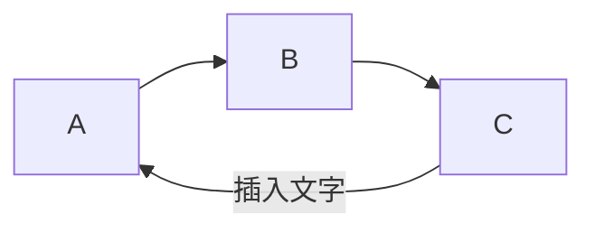
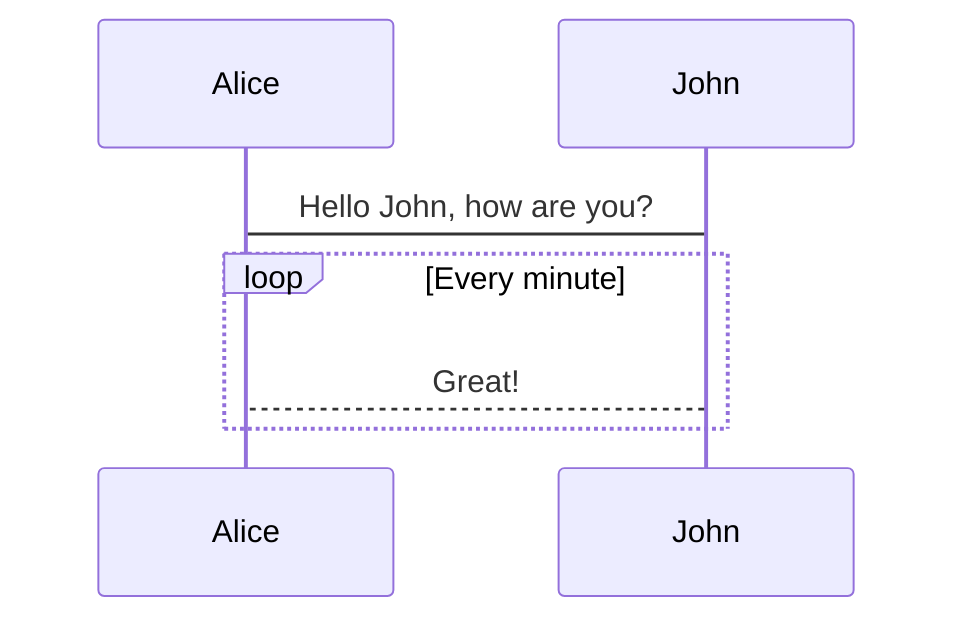

# Nobug Markdown 编辑器

# 标题1
## 标题2
### 标题3
#### 标题4

> Blockquote 引用

```c#
//代码块
Debug.Log("Hello nobug");
```

```js
import { Editor, Viewer } from 'bytemd';
import gfm from '@bytemd/plugin-gfm';

const plugins = [
  gfm(),
  // Add more plugins here
];

const editor = new Editor({
  target: document.body, // DOM to render
  props: {
    value: '',
    plugins,
  },
});

editor.on('change', (e) => {
  editor.$set({ value: e.detail.value });
});
```


- 这是第一段文字
- 这是第二段文字，`内联重点`

**加粗**

*倾斜*

~~删除线~~

跳转链接，开源Markdown editor [ByteMD](https://github.com/bytedance/bytemd).

## 表格


| 标题    | 内容 |
| --------- | ----------- |
| Nobug    	| 6666       |
| Yk 		| lalala     |

## 数学方程式

Inline math equation: $a+b$

$$
\displaystyle \left( \sum_{k=1}^n a_k b_k \right)^2 \leq \left( \sum_{k=1}^n a_k^2 \right) \left( \sum_{k=1}^n b_k^2 \right)
$$

## Mermaid Diagrams

> 流程图



> 时序图



## 脚注

Here's a simple footnote,[^1] and here's a longer one.[^bignote]

[^1]: This is the first footnote.
[^bignote]: Here's one with multiple paragraphs and code.

    Indent paragraphs to include them in the footnote.
    
    `{ my code }`
    
    Add as many paragraphs as you like.